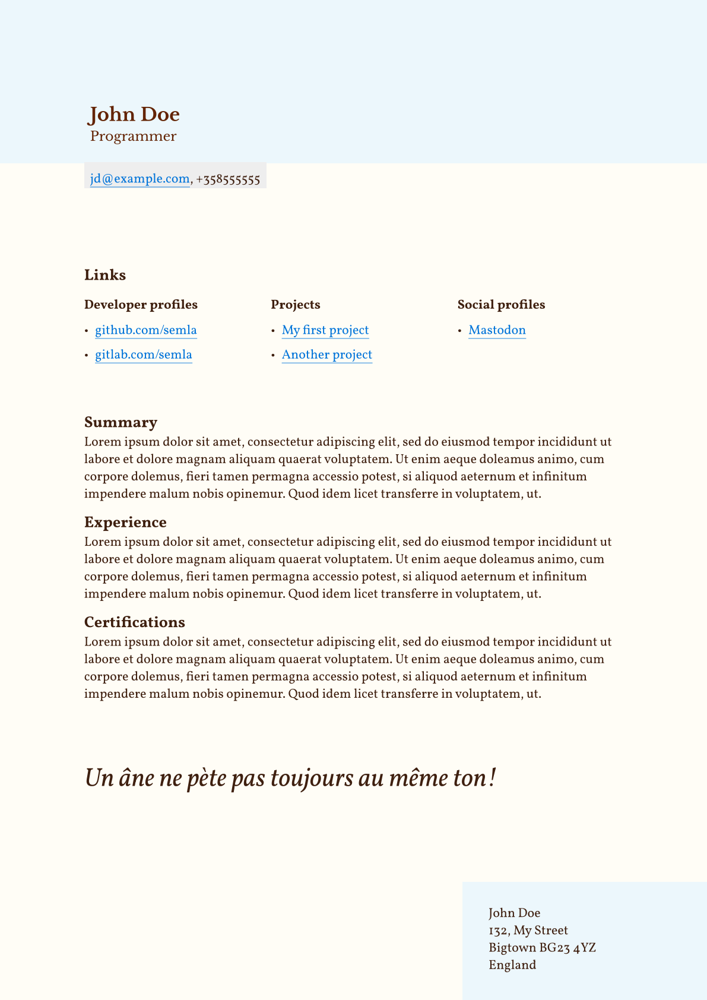

# Resume
Simple resume written in [Typst](https://github.com/typst/typst).
## Data
The resume reads from [data.toml](https://github.com/semla/resume-el-square/blob/master/data.toml)

### PDF
Create [pdf](https://github.com/semla/resume-el-square/blob/master/main.pdf) with:\
`typst compile main.typ`

#### fonts
- [Libre Baskerville](https://fonts.google.com/specimen/Libre+Baskerville)
- [Vollkorn](https://fonts.google.com/specimen/Vollkorn)

### Preview

---

---
